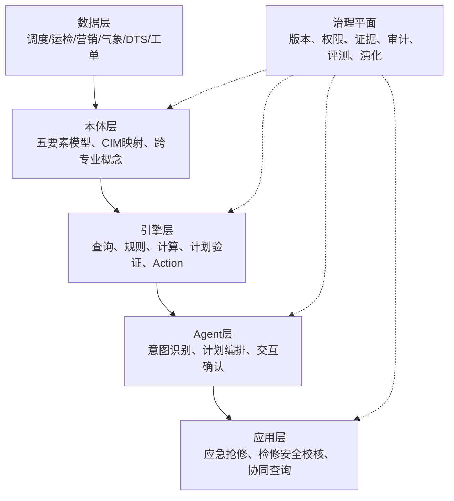

# 任务书技术核心与智能体平台架构解读

结合任务书的两个示范场景，项目的技术核心可以具体表述为：

> 建立一套以操作化本体为共同语义底座、以规则和状态为约束、以智能体为编排入口、以业务系统工具为执行手段的跨专业认知执行平台。

本文将“可操作本体”作为项目叙事和工程设计用语，也称“操作化本体”。目前国际研究中没有一个与之完全对应、定义统一的单一术语。它更准确地表示一组技术的组合：本体负责统一业务概念和关系，规则与约束负责定义边界，函数和语义服务负责提供可调用能力，计划模型负责组织步骤和状态，溯源模型负责记录证据和过程。任务书的创新重点，不是重新发明本体语言，而是把这些能力组合成适用于电网调度、运检和营销协同的认知执行底座。

平台要解决的核心问题不是让大模型回答得更像专家，而是让系统能够在调度、运检、营销之间形成一条可验证的业务链：

```text
业务事件
→ 统一语义理解
→ 跨专业数据融合
→ 规则与约束校验
→ 生成业务计划
→ 工具或业务系统执行
→ 状态和结果复核
→ 证据、审计和知识演化
```

## 一、两个场景体现的技术核心

### 1. 极端气象下应急抢修调度

该场景面对动态、突发和不确定的问题：

```text
气象预警
→ 识别受影响设备和区域
→ 评估停电范围
→ 识别重要和敏感用户
→ 查询可用人员、车辆、物资
→ 制定抢修优先级和派工方案
→ 校验运行方式和复电条件
→ 执行抢修与复电
→ 通知用户并沉淀事件经验
```

技术重点包括：

- 气象、调度、运检、营销数据的快速融合；
- 同一线路、设备、供电点和用户的跨专业概念对齐；
- 影响范围和抢修优先级的规则化判断；
- 资源约束下的任务分配；
- 抢修过程中的状态持续更新；
- 方案调整和异常处理；
- 每个结论能够追溯到设备、用户、工单和规则。

### 2. 计划检修方式下的调度安全校核

该场景面对的是相对稳定但约束密集的问题：

```text
检修申请
→ 读取设备和运行方式
→ 形成检修方式
→ 计算潮流和安全裕度
→ 执行 N-1 校核
→ 执行五防和工作票规则校验
→ 评估停电影响和营销约束
→ 调整方案
→ 审批、执行和复核
```

技术重点包括：

- 运行方式、检修申请、工作票和设备状态的统一表达；
- 潮流计算、N-1、稳定限额和五防规则的组合校验；
- 调度、运检、营销之间的影响分析；
- 硬约束阻断和软约束告警；
- 方案的可解释性、可回放性和审批留痕。

两个场景需要同一个平台，但使用不同的场景能力包：

| 公共平台能力 | 应急抢修能力包 | 检修安全校核能力包 |
|---|---|---|
| 跨专业概念映射 | 气象预警、故障、线路、用户、抢修资源 | 检修申请、运行方式、工作票、设备状态 |
| 本体子图检索 | 影响范围和抢修资源子图 | 检修设备和安全约束子图 |
| 规则引擎 | 优先级、复电、敏感用户、资源规则 | N-1、五防、限值、审批规则 |
| 业务计划 | 抢修派工和复电计划 | 检修方式和安全校核计划 |
| Action 执行 | 派工、资源调配、停送电通知 | 方案提交、审批、状态更新 |
| 审计 | 事件响应和抢修过程追踪 | 校核依据、审批和执行追踪 |

## 二、智能体架构

平台不宜设计成多个自由对话的专业 Agent。更合适的是一个协调 Agent 加多个专业能力服务：

```text
协调 Agent
  ├─ 调度能力服务
  ├─ 运检能力服务
  ├─ 营销能力服务
  ├─ 气象/DTS/计算能力服务
  └─ 规则和审计服务
```

协调 Agent 负责理解任务、拆分问题和组织步骤；专业能力服务负责提供确定性的查询、计算、规则和操作。这样可以避免多个 Agent 各自解释同一设备、各自选择不同口径。

智能体运行时的中心对象应是“业务计划”，而不是一次次自由工具调用：

```text
BusinessPlan {
  goal
  involved_domains
  ontology_concepts
  query_steps
  rule_checks
  actions
  preconditions
  expected_postconditions
  required_evidence
  approval_requirements
}
```

运行时执行流程应是：

```text
用户请求
→ 意图识别和概念链接
→ 选择调度/运检/营销本体子图
→ 生成业务计划
→ 校验类型、权限、前置条件和规则
→ 查询或计算
→ 重新检查动态状态
→ 申请人工确认
→ 执行 Action
→ 校验后置状态
→ 返回带证据的结论
```

其中：

- 大模型负责语言理解、计划生成、异常解释和用户交互；
- 本体运行时负责对象、关系、状态和版本；
- 规则引擎负责安全约束和业务判断；
- 计算服务负责潮流、影响范围等确定性计算；
- Action Runtime 负责业务变更；
- 审计服务负责全过程留痕。

## 三、平台五层架构

任务书中的平台可以落成以下五层：



平台还需要一个离线本体工程链：

```text
业务文档和规程
→ UOM Forge 抽取与专家审阅
→ UOM 本体编译和版本发布
→ OAG 运行时加载
→ 场景回归测试
```

## 四、平台的核心理念

### 1. 本体优先

大模型不能自行发明业务概念、关系、状态或规则。所有业务语义都应尽量落在本体、规则库或来源数据中。

### 2. 证据优先

事实必须来自数据记录或原文条款，规则结论必须来自规则执行结果，无法确认时明确返回未知、冲突或需要人工确认。

### 3. LLM 负责编排，确定性引擎负责裁决

大模型适合语言理解、计划生成和结果解释；规则、计算、权限、状态变更和安全校核由确定性组件完成。

### 4. 查询、判断、执行分离

只读查询、规则判断和写入操作不能混成一个不可解释的 Agent 回合。写操作应经过预览、规则校验、授权确认和审计提交。

### 5. 专业自治，语义互联

调度、运检、营销保留各自专业模型和数据口径，通过统一概念 ID、映射关系和共享对象建立协同，不能简单把各专业数据拼成一张大表。

### 6. 允许未知和冲突存在

跨专业数据可能不一致，系统应保留来源、时间和冲突状态，让 Agent 暂停或请求确认，不能强行选择一个看似合理的答案。

### 7. 版本化和可重放

每次推理和执行都要绑定本体、规则、映射和数据版本。相同输入和版本应能够重放，知识变更应支持影响分析、回归测试和回滚。

### 8. 场景牵引而不是模型堆叠

架构设计最终要围绕两个场景验收。两个场景应从概念、关系、规则和工作流设计阶段就参与系统建设，而不是平台完成后再临时接入。

## 五、现有项目的分工

- `uom-forge`：文档理解、五要素候选建模、证据追踪和专家协同；
- `uom`：领域模型编译、跨源数据查询、版本变更、Action 和运行时数据底座；
- `oag-agent`：Agent 会话、工具编排、规则工具、确认机制和执行管线；
- 电网领域模块：调度、运检、营销本体，气象和 DTS 接入，两个场景的规则、函数和业务操作。

最终平台不应只是一个聊天窗口，而应至少包括：

- 本体建模和版本治理工作台；
- 跨专业语义查询和子图检索服务；
- 规则与安全校核引擎；
- 业务计划和操作执行运行时；
- 应急抢修和检修安全校核场景工作台；
- 证据、审计、回放和评测中心。

最终目标是形成：

> 一套可以被编译、查询、校验、执行、审计和持续演化的电网操作化本体及其认知执行运行时。

## 六、相关研究脉络

### 1. 本体和形式化知识表示：解决“业务概念如何统一”

本体研究的基础工作是 Gruber 提出的可共享、可复用的概念化形式化规范。OWL 2 则提供了描述类、属性、个体和逻辑公理的标准化语言。这一脉络解决的是概念、关系和语义一致性问题，是可操作本体的语义底座。

- Gruber, *A Translation Approach to Portable Ontology Specifications*, 1993，DOI：[10.1006/knac.1993.1008](https://doi.org/10.1006/knac.1993.1008)。
- W3C, [OWL 2 Web Ontology Language Overview](https://www.w3.org/TR/owl2-overview/)。

对本项目的启示是：调度、运检、营销中的“线路、设备、故障、用户、工单”等概念必须有稳定的类型、标识和关系，不能只靠提示词约定。

### 2. 规则、约束和数据质量：解决“什么情况下允许成立”

OWL 的开放世界语义适合表达知识，但对业务数据完整性和操作前置条件还不够。SWRL 可以扩展 OWL 的规则表达，SHACL 则适合对 RDF 图进行形状约束和校验。两者共同说明：本体要进入业务执行，必须增加规则和验证层。

- W3C, [SWRL: A Semantic Web Rule Language](https://www.w3.org/Submission/SWRL/)。
- W3C, [Shapes Constraint Language (SHACL)](https://www.w3.org/TR/shacl/)。
- Horrocks 等，*SWRL: A Semantic Web Rule Language Combining OWL and RuleML*，2004，见 W3C 提交稿。

对本项目的对应关系是：类型约束、关系约束和数据完整性可以由本体/SHACL 处理；N-1、五防、运行限值、审批条件和复电条件还需要规则引擎、计算服务和状态校验共同处理。

### 3. 语义服务与可执行过程：解决“本体如何连接业务能力”

OWL-S 将 Web 服务描述为具有输入、输出、前置条件和结果的语义服务，并支持服务发现、组合和执行。它与本项目的 Action 契约非常接近：一个业务动作不能只声明函数名，还要声明对象类型、参数、前置条件、后置状态、权限和证据要求。

- W3C, [OWL-S: Semantic Markup for Web Services](https://www.w3.org/Submission/OWL-S/)。
- Martin 等，*Bringing Semantics to Web Services: The OWL-S Approach*，2005，DOI：[10.1007/978-3-540-30581-1_4](https://doi.org/10.1007/978-3-540-30581-1_4)。
- Elve and Preisig，*From Ontology to Executable Program Code*，2019，DOI：[10.1016/j.compchemeng.2018.09.004](https://doi.org/10.1016/j.compchemeng.2018.09.004)。

本项目可以沿用这条思路，把“切换设备、提交检修方案、派发抢修工单、发送停电通知”等业务动作建模为带有语义契约的 Action，而不是普通工具函数。

### 4. AI 规划和动作模型：解决“如何从目标得到步骤”

PDDL、HTN 和时序规划研究把目标、状态、动作、前置条件和效果形式化，并由规划器搜索可行步骤。相关研究表明，长链路计划不应完全依赖语言模型的自由生成，而应将自然语言目标转换为结构化规划问题，再交给确定性规划或约束求解器验证。

- McDermott 等，*PDDL—The Planning Domain Definition Language*，1998，规划领域定义语言的基础工作。
- *Automating Knowledge Discovery Workflow Composition Through Ontology-Based Planning*，2010，DOI：[10.1109/TASE.2010.2070838](https://doi.org/10.1109/TASE.2010.2070838)。
- *A Planning Ontology to Represent and Exploit Planning Knowledge for Performance Efficiency*，2023，arXiv：[2307.13549](https://arxiv.org/abs/2307.13549)。

对任务书的直接启示是：应把“应急抢修计划”和“检修安全校核计划”建模为可验证的业务计划，明确步骤、分支、前置条件、后置条件、审批点和回滚策略。

### 5. 本体驱动自治系统：解决“知识如何参与真实行动”

机器人和自治系统研究已经形成了较成熟的“知识库—任务推理—行动执行”路线。KnowRob 将对象、事件、动作和过程知识连接到机器人控制与执行；相关综述比较了本体在状态表示、任务规划、能力描述和自治控制中的用法。

- Tenorth and Beetz，*KnowRob: A Knowledge Processing Infrastructure for Cognition-Enabled Robots*，2013，DOI：[10.1177/0278364913481635](https://doi.org/10.1177/0278364913481635)。
- Olivares-Alarcos 等，*A Review and Comparison of Ontology-Based Approaches to Robot Autonomy*，2019，DOI：[10.1017/S0269888919000237](https://doi.org/10.1017/S0269888919000237)。
- Lane 等，*An Ontology-Based Approach to Fault Tolerant Mission Execution for Autonomous Platforms*，2012，DOI：[10.1007/978-1-4614-5659-9_5](https://doi.org/10.1007/978-1-4614-5659-9_5)。

本项目与这一脉络的相似点是都要处理状态、能力、动作和异常；差异在于电网 Action 具有更强的安全、权限、审批和跨专业约束，必须把规则校核和审计作为运行时的一等能力。

### 6. 大模型与工具、规划和行动：解决“自然语言如何进入执行闭环”

LLM Agent 研究提供了语言理解、工具调用和计划生成的方法，但也暴露出自由生成难以保证长链路正确性的问题。SayCan 用语言模型选择技能，再用环境可行性进行过滤；ReAct 将推理和行动交替；Toolformer 学习调用外部 API；LLM+P 则把自然语言规划问题交给经典规划器。这些工作与本项目的关系可以概括为：大模型适合提出候选意图和计划，领域本体、规则和规划器负责裁决计划是否成立。

- Ahn 等，*Do As I Can, Not As I Say: Grounding Language in Robotic Affordances*，2022，arXiv：[2204.01691](https://arxiv.org/abs/2204.01691)。
- Yao 等，*ReAct: Synergizing Reasoning and Acting in Language Models*，2023，arXiv：[2210.03629](https://arxiv.org/abs/2210.03629)。
- Schick 等，*Toolformer: Language Models Can Teach Themselves to Use Tools*，2023，arXiv：[2302.04761](https://arxiv.org/abs/2302.04761)。
- Liu 等，*LLM+P: Empowering Large Language Models with Optimal Planning Proficiency*，2023，arXiv：[2304.11477](https://arxiv.org/abs/2304.11477)。

本项目需要把这些通用方法改造成“本体链接—子图检索—结构化计划—规则验证—Action 执行”的领域运行时，不能只把电网系统包装成一组自然语言工具。

### 7. LLM 辅助本体构建：解决“本体如何持续生产和更新”

SPIRES 通过结构化提示和递归抽取，把文本内容填充到预先定义的知识模式中，适合支持本体实例化和候选知识生成。它不能替代专家治理，但可以降低从规程、标准、工单和事件报告中发现候选概念、关系和规则的成本。

- Callahan 等，*Structured Prompt Interrogation and Recursive Extraction of Semantics (SPIRES): A Method for Populating Knowledge Bases Using Zero-Shot Learning*，2023，arXiv：[2304.02711](https://arxiv.org/abs/2304.02711)，后发表于 *Bioinformatics*，DOI：[10.1093/bioinformatics/btae104](https://doi.org/10.1093/bioinformatics/btae104)。

这与课题二的 LLM 自动构建和质量校验相对应，但任务书还需要增加跨专业概念消解、规则理解准确率、专家复核和版本回归测试。

### 8. 溯源、版本和审计：解决“为什么相信这个结论”

PROV-O 提供了实体、活动、代理以及生成、使用、派生等溯源关系；PAV 进一步关注作者、版本和来源。这些模型不能直接完成电网安全校核，但可以为“结论—本体版本—规则版本—数据快照—工具返回—人工确认—状态变化”的审计链提供标准化表达。

- W3C, [PROV-O: The PROV Ontology](https://www.w3.org/TR/prov-o/)。
- Ciccarese 等，*PAV Ontology: Provenance, Authoring and Versioning*，2013，DOI：[10.1186/2041-1480-4-37](https://doi.org/10.1186/2041-1480-4-37)。

这条脉络直接支撑任务书中“可审计、可回放、可追责”的要求。平台应把审计记录设计成结构化事件，而不是只保存一段 Agent 对话文本。

## 七、相关研究与本项目的关系

| 研究脉络 | 已经解决的核心问题 | 本项目需要继续解决的问题 |
|---|---|---|
| OWL、SWRL、SHACL | 概念、公理、规则和数据约束 | 把电网安全规则、动态状态和计算结果纳入统一计划校验 |
| OWL-S、语义服务 | 能力、输入输出、前置条件和服务组合 | 把电网业务 Action 与权限、审批、后置状态和审计绑定 |
| PDDL、HTN、工作流规划 | 从目标和状态生成可行步骤 | 面向调度、运检、营销跨专业计划进行约束求解和人工确认 |
| KnowRob、自治机器人 | 知识驱动状态理解和动作执行 | 适配电网设备、运行方式、检修和抢修的高风险操作边界 |
| SayCan、ReAct、Toolformer、LLM+P | 语言模型与工具、技能、规划器结合 | 让 LLM 只能在本体和规则定义的 Action 空间内生成和修复计划 |
| SPIRES 等 LLM 本体构建 | 从文本中生成结构化候选知识 | 解决跨专业概念消解、规则质量、专家闭环和版本演化 |
| PROV-O、PAV | 来源、派生、版本和活动溯源 | 形成结论、规则、数据、工具、确认和状态变化的完整审计链 |
| IEC CIM（61970/61968） | 电力系统对象和交换语义基础 | 在 CIM 之上补充函数、规则、Action、状态和跨专业业务计划 |

从这些工作可以看出，“可操作本体”不是把知识图谱换一个名称，而是把静态语义模型向运行时推进：

```text
概念和关系
→ 约束和规则
→ 能力和 Action
→ 计划和状态
→ 执行和反馈
→ 证据和审计
```

任务书的研究价值主要在于把这条链放入电网调度、运检和营销协同场景中，并形成可量化的工程验证：不少于 250 个概念、300 条关系、50 条规则及约束，跨专业概念消解准确率不低于 85%，知识抽取 F1 不低于 80%，规则理解准确率不低于 95%，以及两个端到端场景验证。

因此，后续写作中建议使用下面这句更严谨的表述：

> 本项目提出的“可操作本体”是面向电网认知执行的工程化综合概念，其理论基础来自本体与知识表示、规则约束、语义服务、AI 规划、自治系统知识库、LLM 工具调用和溯源审计等研究脉络；项目的技术贡献在于将这些能力统一到跨专业电网业务计划和智能体运行时中。
